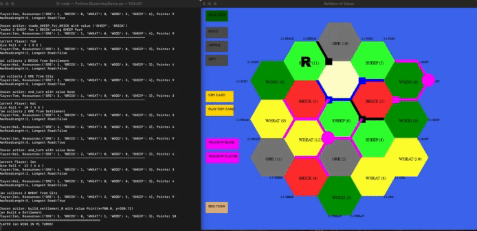
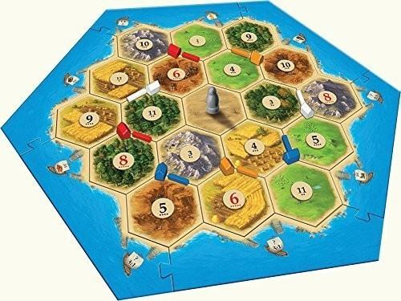

# Catan AI

### [Full Write-Up](https://github.com/kpstern/COGS188_SP24/blob/main/FinalProject_TIK.pdf)

## Group Members
Tom Hocquet, [Ian Zane](https://github.com/ifzane), [Kai Stern](https://github.com/kpstern)

## Abstract

In this project, we aim to develop a reinforcement learning (RL) model that can learn to play Settlers of Catan, a multiplayer board game about trading and resource management. Specifically, we aim to use this model to note how the evolution of group dynamics and play styles in a set of agents that repeatedly play each other might be different than agents trained for a more game theory optimal strategy. Catan has a whooping <strong>244,432,188,000</strong> possible starting states, meaning that our agents cannot just memorize games but learn the strategies. We used a virtual environment to train a singular cohort of agents. The same set of agents will repeatedly play against each other, creating an environment similar to how many people would play board games. Below is a gif of the model learning. 

[Website](https://www.dicebreaker.com/games/catan-1/how-to/how-to-play-catan-board-game) explaining the rules of catan

## Catan Implementation

This was implemented using an adapted version of the Catan AI developed by Karan Vombatkere. The original is accessible at the link below:
[Karan Vombatkere's Catan AI](https://github.com/kvombatkere/Catan-AI)

## Files

### [Catan-AI](https://github.com/tomok59/Catan-AI/tree/main/Catan-AI)
Folder containing the edited versions of Karan Vombatkere's Catan-AI plus our modified or implemented files.

#### [code](https://github.com/tomok59/Catan-AI/tree/main/Catan-AI/code)
Folder containing the code used in the project.

- [AIGame.py](https://github.com/kpstern/COGS188_SP24/blob/main/Catan-AI/code/AIGame.py): Implementation to play a game with just the heuristic AI developed by Vombatkere.
- [QLearningAIPlayer.py](https://github.com/kpstern/COGS188_SP24/blob/main/Catan-AI/code/QLearningAIPlayer.py): Our implementation of the agent using Q-learning.
- [QLearningGame.py](https://github.com/kpstern/COGS188_SP24/blob/main/Catan-AI/code/QLearningGame.py): Implementation to play a game with just Q-learning agents.
- [board.py](https://github.com/kpstern/COGS188_SP24/blob/main/Catan-AI/code/board.py): The class that manages the Catan game board.
- [catanGame.py](https://github.com/kpstern/COGS188_SP24/blob/main/Catan-AI/code/catanGame.py): Implementation to play a game with one heuristic AI and the rest humans.
- [gameView.py](https://github.com/kpstern/COGS188_SP24/blob/main/Catan-AI/code/gameView.py): Pygame display for the Catan game.
- [heuristicAIPlayer.py](https://github.com/kpstern/COGS188_SP24/blob/main/Catan-AI/code/heuristicAIPlayer.py): Original implementation of the heuristic AI.
- [player.py](https://github.com/kpstern/COGS188_SP24/blob/main/Catan-AI/code/player.py): Base player class which is expanded upon for AI players (either heuristic or Q-learning).
